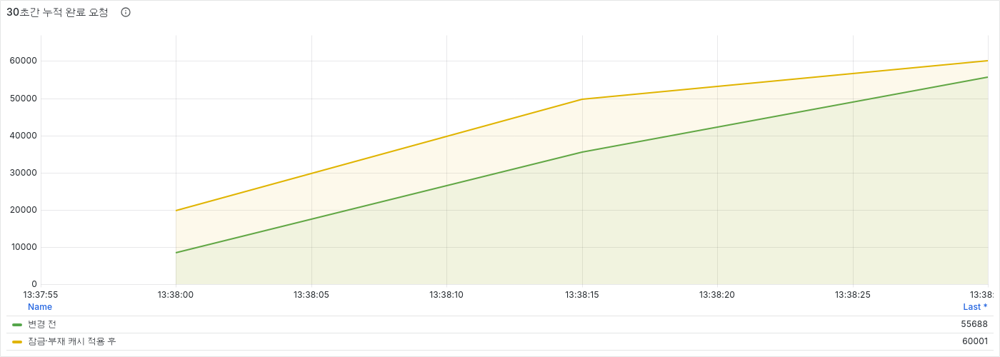
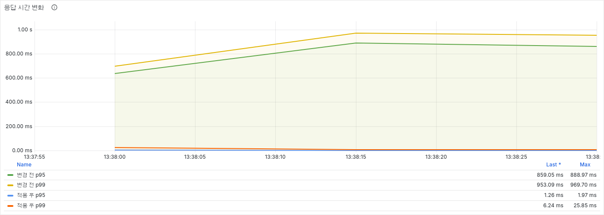
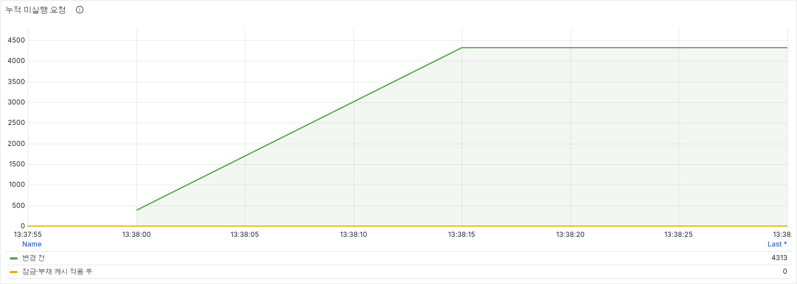

# 삭제된 게시글 반복 조회와 콜드 미스 폭주 방지

## 문제

- 작성자나 운영자가 인기글을 삭제해도 검색 결과·메신저 공유·브라우저 방문 기록에는 기존 상세 URL이 남는다.
- 사용자가 이 URL을 다시 열거나 검색 엔진이 재방문하면 같은 삭제 게시글 ID로 조회가 반복된다.
- 사용자에게 404를 반환하는 것과 별개로, 기존 Article Read Service는 Redis에 값이 없는 상태와 실제로 게시글이 존재하지 않는 상태를 구분하지 못했다.
- 그 결과 요청마다 Article Service와 MySQL을 다시 조회해 이미 삭제된 게시글이 원본 서비스의 처리량을 계속 사용했다.

이 프로젝트에는 실사용자가 없으므로 운영 장애로 표현하지 않았다. 삭제된 인기글 URL에 요청이 집중되는 실제 접근 경로를 가정하고 로컬에서 재현했다.

## 단계형 부하에서 다시 발견한 문제

인위적인 지연을 넣지 않고 요청률을 단계적으로 높였다. 1,900 req/s에서는 요청을 모두 처리했지만, 2,000 req/s부터 처리율이 목표를 따라가지 못하며 포화가 시작됐다.

| 요청률 | 실제 처리율 | p95 | p99 | 시작하지 못한 요청 |
|:---:|:---:|:---:|:---:|:---:|
| 1,800 req/s | 1,800 req/s | 25.47ms | 80.75ms | 0건 |
| 1,900 req/s | 1,900 req/s | 82.58ms | 225.62ms | 0건 |
| 2,000 req/s | 1,856 req/s | 859.05ms | 953.09ms | 4,313건 |

2,000 req/s에서 부재 캐시만 적용하자 정상 구간의 p95는 2.88ms로 줄었지만, 캐시가 만들어지기 전 첫 요청들이 동시에 원본으로 전달됐다. Article Read Service의 요청 처리 스레드 수만큼 원본 조회 200건이 한꺼번에 발생하면서 p99가 1.56초로 튀고 요청 2,222건을 시작하지 못했다.

즉 부재 캐시는 반복 조회를 막았지만, 콜드 미스 순간의 동시 원본 조회까지 막지는 못했다.

## 기술 선택

- Bloom Filter — 제외
  - 존재 가능성을 빠르게 거를 수 있지만 게시글 생성·삭제에 맞춘 동기화와 재구축 경로 필요
  - 동일한 잘못된 ID에 집중되는 현재 문제에는 운영 복잡도가 과도

- 모든 요청에 잠금 적용 — 제외
  - 캐시가 이미 채워진 정상 조회까지 잠금 경로를 거쳐 처리량 저하 가능

- 짧은 부재 캐시 — 채택
  - Article Service가 404를 반환한 ID에 `MISSING` 값을 60~70초간 저장
  - 타임아웃과 5xx는 저장하지 않아 원본 장애를 게시글 없음으로 오인하지 않음

- 콜드 미스 최초 조회 잠금 — 채택
  - 부재 캐시와 조회 모델이 모두 없을 때만 Redis `SET NX`로 3초 잠금 획득
  - 잠금 소유자 한 명만 원본을 확인하고 나머지는 최대 2초간 결과 대기
  - 잠금 값에 요청별 토큰을 저장하고 Lua로 토큰이 일치할 때만 삭제해 다른 요청의 잠금 해제 방지

## 구현

```java
if (missingArticleCacheRepository.isMissing(articleId)) {
    throw articleNotFound(articleId);
}

String lockOwner = UUID.randomUUID().toString();
if (!articleLookupLockRepository.tryAcquire(articleId, lockOwner)) {
    return awaitLookupResult(articleId);
}

try {
    Optional<ArticleQueryModel> loaded = fetch(articleId);
    if (loaded.isEmpty()) {
        missingArticleCacheRepository.markMissing(articleId);
    }
    return loaded;
} finally {
    articleLookupLockRepository.release(articleId, lockOwner);
}
```

- 잠금 획득 후 조회 모델과 부재 캐시를 다시 확인해 대기 중 만들어진 값을 중복 조회하지 않음
- 잠금을 얻지 못한 요청은 10ms 간격으로 조회 모델 또는 `MISSING` 생성을 확인
- 2초 안에 결과가 만들어지지 않으면 잘못된 404 대신 503 반환
- 게시글이 존재할 때만 댓글 수와 좋아요 수를 병렬 조회

## 최종 검증

동일한 삭제 게시글 ID에 2,000 req/s를 30초간 요청했다. 이 요청률은 예상 운영 트래픽이 아니라 로컬 환경에서 병목이 드러나는 포화점이다. JVM 초기화 영향을 줄이기 위해 다른 ID로 먼저 예열하고, 측정 직전 대상 ID의 부재 값과 잠금 키만 삭제했다.

| 지표 | 변경 전 | 부재 캐시만 적용 | 잠금·부재 캐시 적용 |
|:---:|:---:|:---:|:---:|
| 완료 요청 | 55,688건 | 57,779건 | 60,001건 |
| 실제 처리율 | 1,856 req/s | 1,926 req/s | 2,000 req/s |
| Article Service 원본 조회 | 55,688건 | 200건 | 1건 |
| p95 | 859.05ms | 2.88ms | 1.26ms |
| p99 | 953.09ms | 1,563.18ms | 6.24ms |
| 최대 응답 시간 | 1,051.05ms | 1,768.70ms | 80.70ms |
| 시작하지 못한 요청 | 4,313건 | 2,222건 | 0건 |

### 30초간 누적 완료 요청



- 변경 전에는 시간이 지날수록 처리량이 유입량을 따라가지 못해 55,688건에서 종료
- 적용 후에는 누적 요청이 일정하게 증가해 목표한 60,001건을 모두 처리

### 응답 시간 변화



- p95 `859.05ms → 1.26ms`, 약 99.85% 감소
- p99 `953.09ms → 6.24ms`, 약 99.35% 감소

### 누적 미실행 요청



- 시작하지 못한 요청 `4,313건 → 0건`
- 원본 조회 `55,688건 → 1건`
- 최초 잠금 경합 64건은 원본을 재호출하지 않고 부재 값 생성을 기다린 뒤 404 반환

## 검증 범위와 한계

- 로컬 Docker Compose 환경의 상대 비교이며 운영 환경의 최대 처리량을 의미하지 않음
- 한 개의 삭제 게시글 ID에 요청이 집중되는 조건으로 콜드 미스와 캐시 관통을 재현
- 계속 다른 임의 ID를 요청하는 공격은 부재 캐시 적중률이 낮으므로 API Rate Limit과 Redis 메모리 관측 필요
- 잠금 대기는 요청 스레드를 최대 2초간 사용하므로 원본 조회가 지속적으로 느리다면 별도 비동기 조정 필요
- 부재 TTL 동안 동일 ID가 생성되면 게시글 생성 이벤트가 부재 표시를 제거
