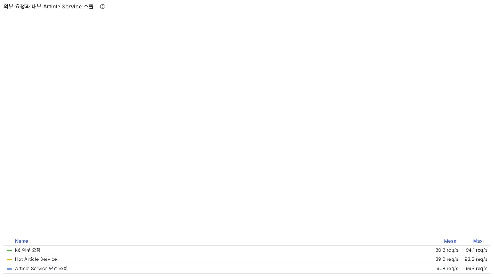
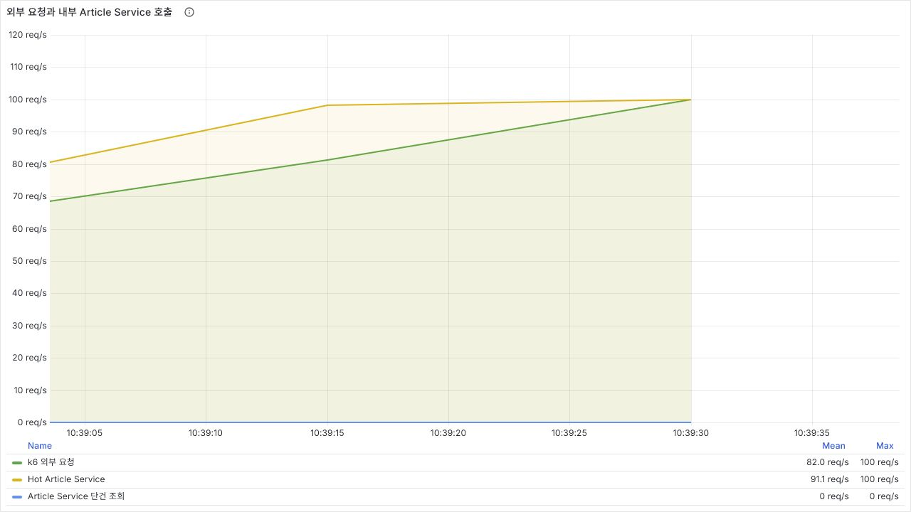
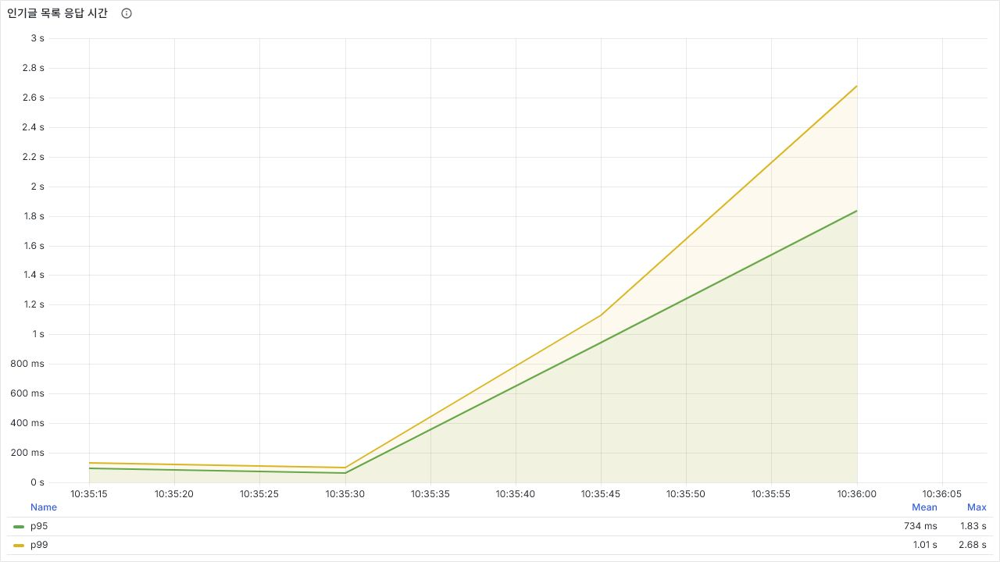
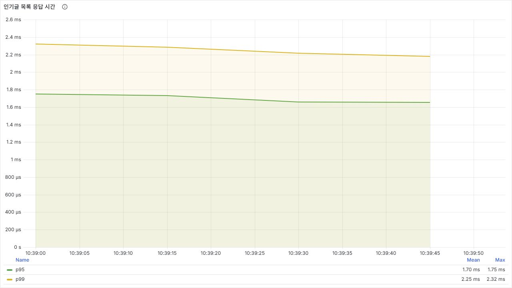
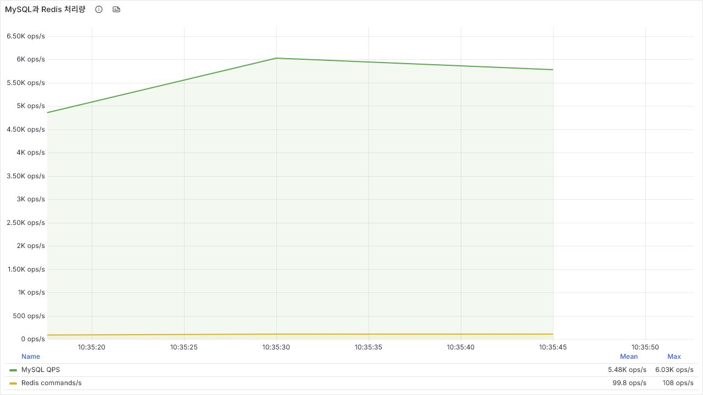
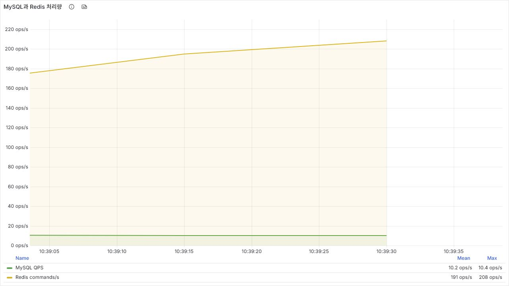
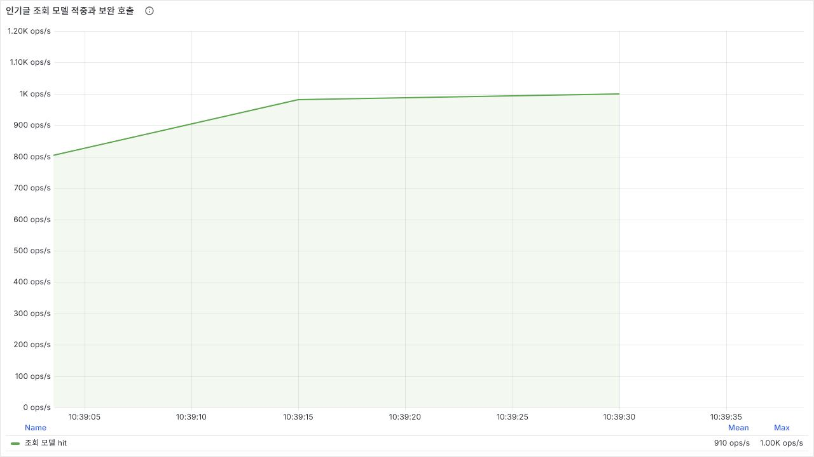

# 인기글 조회 호출 증폭과 CQRS 읽기 모델

## 문제 발견

로컬 통합 환경에서 인기글 목록에 트래픽을 높이는 과정 중 `75 req/s`까지 20ms대이던 응답 시간이 `100 req/s`에서 p95 `1.83초`로 급증.

Redis에 오늘의 인기글 Top 10이 이미 저장되어 있어 캐시가 적용된 것으로 보였지만, 실제로 저장된 값은 게시글 ID와 점수뿐. 목록 요청마다 10개 ID를 꺼낸 뒤 Article Service의 단건 조회 API를 10회 호출하는 구조 확인.

```java
return hotArticleListRepository.readAll(dateStr).stream()
        .map(articleClient::read)
        .filter(Objects::nonNull)
        .map(HotArticleResponse::from)
        .toList();
```

- 외부 목록 요청 `100 req/s`가 내부 단건 조회 약 `1,000 req/s`로 증폭
- 인기글 트래픽이 Hot Article Service를 넘어 Article Service와 MySQL까지 전파
- 인기글 순위 캐시와 화면 표시용 데이터 캐시가 서로 다른 문제임을 확인

## 개선 방향

인기글 화면에 필요한 `articleId`, `title`, `createdAt`만 Hot Article Service의 Redis 조회 모델로 분리. 당일 생성 게시글의 생성·수정 이벤트만 반영하고, 삭제 이벤트는 조회 모델과 순위에서 제거하는 CQRS projection 구성.

```java
List<Long> articleIds = hotArticleListRepository.readAll(dateStr);
Map<Long, HotArticleQueryModel> queryModels =
        hotArticleQueryModelRepository.readAll(articleIds);
```

- Redis Sorted Set에서 Top 10 ID 조회
- `MGET` 한 번으로 10개 조회 모델 일괄 조회
- 순위와 조회 모델은 다음 날 01시에 함께 만료
- 이벤트 처리 전이거나 TTL 만료로 누락된 항목만 Article Service에서 보완 조회
- 보완 조회 결과를 Redis에 다시 저장해 다음 요청부터 조회 모델 사용
- hit·miss·보완 호출을 별도 Prometheus 지표로 관측

이 구조는 원본 데이터를 단순 복제하는 범용 캐시보다 인기글 조회 요구에 맞춘 읽기 모델에 가까움. 명령은 기존 게시글 서비스가 처리하고, 조회에 필요한 최소 데이터는 이벤트로 별도 구성.

## 부하 테스트 설정

인위적인 지연 코드 없이, 작은 서비스 인스턴스를 가정한 동일 자원 조건에서 변경 전·후를 비교.

| 항목 | 설정 |
|:---:|:---:|
| 실행 환경 | 로컬 PC · Docker Compose |
| 인기글 데이터 | 당일 생성 게시글 Top 10 |
| Hot Article Service | 1 vCPU · 448MB |
| Article Service | 1 vCPU · 576MB |
| MySQL | 2 vCPU · 2GB |
| 부하 방식 | k6 constant-arrival-rate |
| 단계 | warm-up 50 req/s → 75 → 100 → 150 → 200 → 250 req/s |
| 단계별 시간 | 45초 |
| 검증 | HTTP 200과 응답 항목 10개 동시 확인 |

`100 req/s`는 운영 최대 처리량을 주장하기 위한 숫자가 아니라, 동일한 소형 자원에서 호출 증폭으로 인해 응답이 무너지는 경계를 찾기 위한 부하. 개선 전에는 75→100 req/s 사이에서 비선형 지연이 발생했고, 개선 후에는 같은 조건으로 250 req/s까지 단계적으로 검증.

## 측정 결과

### 100 req/s 동일 조건 비교

| 지표 | 변경 전 | 조회 모델 적용 후 |
|:---:|:---:|:---:|
| p95 | 1.83s | 1.75ms |
| p99 | 2.68s | 2.32ms |
| Article Service 단건 조회 | 약 1,000 req/s | 0 req/s |
| 요청 오류 | 0% | 0% |

변경 전에는 100 req/s 구간에서 내부 단건 조회가 약 10배로 증폭되며 p95가 1초를 초과. 조회 모델 적용 후 Article Service 호출이 제거되고 p95가 약 `99.9%` 감소.

#### 내부 호출 증폭

변경 전: 외부 요청 약 100 req/s에 Article Service 단건 조회 약 1,000 req/s 발생.



변경 후: 외부 요청과 Hot Article Service 처리량은 유지되지만 Article Service 호출은 0 req/s.



#### 응답 시간

변경 전 100 req/s: p95 1.83s, p99 2.68s.



변경 후 100 req/s: p95 1.75ms, p99 2.32ms.



#### 저장소 부하 이동

MySQL QPS는 해당 시간대 서버 전체 값이므로 인기글 요청만의 쿼리 수로 해석하지 않음. 다만 동일한 테스트 구간에서 Article Service 호출 제거와 함께 MySQL 부하가 내려가고 Redis 처리량이 늘어난 방향성 확인.





#### 조회 모델 적중

100 req/s에서 Top 10을 반환하므로 조회 모델 hit는 초당 약 1,000건. miss와 Article Service 보완 호출은 0건.



### 개선 후 추가 부하

| 요청률 | p95 | p99 | dropped iteration |
|:---:|:---:|:---:|:---:|
| 100 req/s | 1.75ms | 2.32ms | 0 |
| 250 req/s | 1.21ms | 1.76ms | 0 |

동일한 로컬 자원 제한에서 250 req/s까지 오류와 유실된 iteration 없이 처리. 이 결과는 운영 환경의 최대 처리량이 아니라 변경 전·후의 상대 비교 결과.

## 실패 경로와 트레이드오프

- Kafka 소비 지연 동안 제목 변경이 즉시 반영되지 않는 최종 일관성 수용
- Redis 조회 모델이 없으면 Article Service 보완 조회로 빈 목록 반환 방지
- 보완 호출 증가를 별도 지표로 감시해 Consumer 지연이나 TTL 설정 문제 탐지
- 당일 생성 게시글만 조회 모델에 저장하고 다음 날 01시에 자동 만료
- 전체 재구축 도구와 이벤트 순서 역전 방어는 후속 과제

## 재현

```bash
TEST_ID=hot-breakpoint-1 \
HOT_WARMUP_RATE=50 \
HOT_WARMUP_DURATION=30s \
HOT_RATES=75,100,150,200,250 \
HOT_STAGE_DURATION=45s \
docker compose run --rm k6 run \
  -o experimental-prometheus-rw /scripts/hot-article-list.js
```

Grafana의 `Modu Square 인기글 부하 테스트` 대시보드에서 `testid`와 요청률 단계를 선택해 비교.
