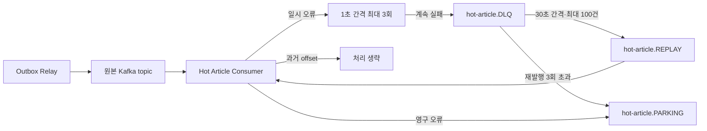

# Kafka Consumer 재시도·DLQ·배치 재처리

## 문제 상황

Transactional Outbox는 MySQL commit 이후 Kafka 발행에 실패한 이벤트를 DB에 보존한다. 하지만 Kafka에 정상 발행된 뒤 Consumer 처리에서 계속 실패하는 메시지는 Outbox의 보호 범위 밖이다.

기존 인기글 Consumer는 처리 예외를 다시 던지고 offset을 승인하지 않았다. 메시지가 사라지지는 않지만 영구적으로 실패하는 poison message가 같은 partition의 뒤 메시지까지 계속 막을 수 있었다. 재시도 횟수, 최종 격리 위치, 복구 절차도 명시돼 있지 않았다.

## 기술 선택 이유

### 무제한 동일 partition 재시도 — 제외

- 일시 장애에는 대응하지만 영구 실패 메시지가 partition 진행을 막음
- 실패 메시지와 재시도 횟수를 별도로 관찰하기 어려움

### 실패 로그만 남기고 offset 승인 — 제외

- Consumer 처리 실패가 곧 메시지 유실로 이어짐
- 장애 원인을 수정한 뒤 다시 처리할 원본 payload가 남지 않음

### `DefaultErrorHandler` + 서비스 전용 DLQ — 채택

- Redis 연결 장애, 데이터 접근 timeout, 이벤트 처리 lock 경합처럼 회복 가능한 예외만 최초 처리 포함 최대 3회 시도
- JSON 형식·필수 필드 오류와 그 밖의 영구 예외는 재시도 없이 `<원본>.hot-article.PARKING`에 보존
- 회복 가능한 예외가 계속 실패한 메시지는 `<원본>.hot-article.DLQ`에 보존
- `DeadLetterPublishingRecoverer`가 원본 topic·partition·offset과 예외 정보를 header에 기록
- DLQ 발행 성공을 확인한 뒤에만 실패한 원본 offset을 commit
- DLQ 발행 자체가 실패하면 원본 offset을 넘기지 않아 메시지 유실 방지

### 제한 건수 batch 재처리 — 채택

- DLQ Consumer는 한 poll에 최대 100건을 가져오고 poll 사이에 30초 대기
- 서비스가 중단됐다 재시작돼도 기존 DLQ를 읽도록 `auto.offset.reset=earliest` 적용
- 다른 Consumer 그룹의 중복 처리를 막기 위해 공용 원본 topic이 아니라 `<원본>.hot-article.REPLAY`로 재발행
- batch의 모든 Kafka 전송이 성공한 뒤에만 DLQ offset 승인
- 같은 실패가 무한 순환하지 않도록 최대 3회 재발행 후 `<원본>.hot-article.PARKING`에 원문 보존

### 원본 offset 기반 최신 버전 검증 — 채택

- REPLAY topic의 offset은 재발행할 때마다 새로 생기므로 최신 여부를 판단하는 기준으로 사용할 수 없음
- DLQ에 기록된 원본 topic·partition·offset을 전용 header로 REPLAY까지 전달
- Redis에 `원본 topic + partition + articleId`별 마지막 처리 offset을 저장하고, 저장된 값보다 오래된 이벤트는 반영하지 않음
- 버전 확인과 이벤트 반영 구간은 짧은 분산 lock으로 직렬화해 원본 Consumer와 REPLAY Consumer의 동시 처리를 방지
- 처리에 성공한 뒤에만 offset을 저장하므로 처리 도중 실패한 이벤트는 다시 시도할 수 있음

## 처리 흐름



Outbox는 Kafka 발행 전 실패를 보완하고, DLQ는 Kafka 발행 후 Consumer 처리 실패를 보완한다. 두 장치는 실패 지점이 다르므로 서로 대체하지 않는다.

## 테스트 및 검증

### 문제 상황 재현

Embedded Kafka에 `board-view`와 `board-like` 메시지를 발행했다. Redis 연결 장애는 최초 처리 1회와 재시도 2회 뒤 DLQ로 이동하고, 형식 오류는 재시도 없이 PARKING으로 이동하는지 검증했다. 단위 테스트에서는 REPLAY가 원본 위치 header를 유지하고 이미 처리한 offset보다 오래된 이벤트를 생략하는지 확인했다.

```bash
./gradlew :service:hot-article:test --tests "board.hotarticle.kafka.*"
```

| 검증 항목 | 결과 |
|---|---:|
| Consumer 총 처리 시도 | 3회 |
| 최초 처리 이후 재시도 | 2회 |
| DLQ 저장 | 1건 |
| DLQ 원본 topic header | `board-view` |
| 영구 오류 처리 시도 | 1회 |
| 영구 오류 PARKING 저장 | 1건 |
| REPLAY 원본 topic·partition·offset 보존 | 통과 |
| 동일하거나 과거 offset 반영 생략 | 통과 |
| 처리 실패 시 최신 offset 미저장 | 통과 |
| 배치 재발행 성공 후 offset 승인 | 통과 |
| 배치 재발행 실패 시 offset 미승인 | 통과 |
| 재발행 한도 초과 시 PARKING 보존 | 통과 |

### 관측 지표

- `modu_kafka_delivery_total{result="retry|dlq|parking|dlq_publish_failed|parking_publish_failed"}`: 재시도와 최종 격리 결과
- `modu_kafka_dlq_replay_total{result="republished|parked|failed"}`: DLQ 재처리 결과
- `modu_kafka_dlq_replay_batch_count`, `modu_kafka_dlq_replay_batch_sum`: poll별 batch 크기

이번 검증은 HTTP 처리량보다 Kafka offset·header·재발행 목적지의 정확성이 핵심이므로 k6 대신 Embedded Kafka 통합 테스트를 사용했다. 대량 backlog 복구 처리율을 조정할 때는 별도의 Kafka 장애 시나리오와 위 지표를 함께 측정한다.

## 남은 한계

- PARKING 메시지는 자동 폐기하지 않는다. 원인을 수정한 뒤 운영자가 검토하고 재주입해야 한다.
- DLQ와 REPLAY topic의 보존 기간·용량 경보는 배포 환경 정책으로 별도 관리해야 한다.
- batch 중 일부 재발행 뒤 다음 전송이 실패하면 offset을 승인하지 않으므로 앞서 성공한 이벤트가 다시 전송될 수 있다.
- 원본 offset은 같은 topic·partition 안에서만 비교할 수 있다. 이벤트 key와 partition 규칙을 바꿀 때는 버전 key 호환성을 함께 검토해야 한다.
- 처리 성공 뒤 버전 offset을 저장하기 전에 프로세스가 종료되면 같은 이벤트가 다시 실행될 수 있으므로 인기글 처리는 절대값 반영 방식의 멱등성을 유지해야 한다.
