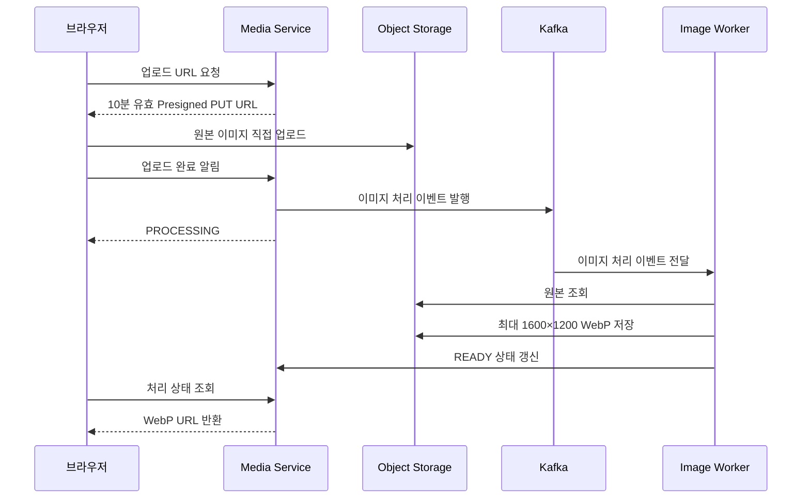
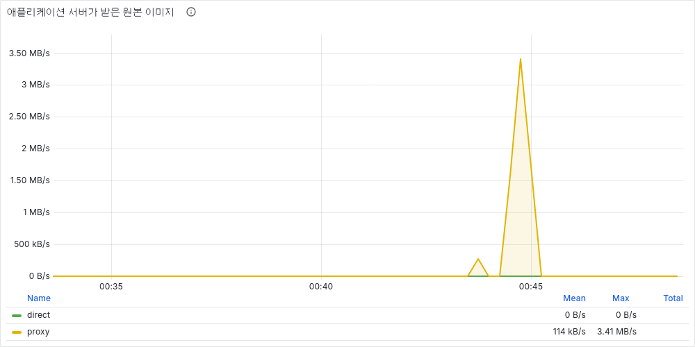
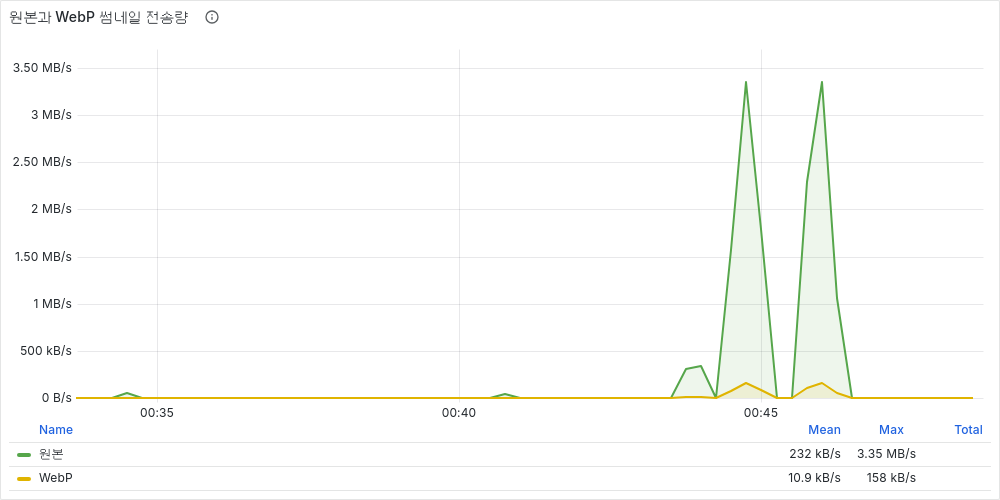

# 이미지 첨부와 전송 비용 최적화

## 문제

커뮤니티 게시글에 원본 이미지를 첨부하면 업로드와 조회 트래픽이 애플리케이션 서버를 통과함. 이미지 요청이 늘어날수록 API 처리와 무관한 대용량 바이트 전송이 서버 네트워크와 메모리를 점유하고, 원본을 그대로 내려주면 조회할 때마다 전송량이 반복됨.


## 구현



- JPEG·PNG·WebP만 허용하고 파일당 10MB, 게시글당 5장으로 제한
- Presigned URL을 이용해 원본 파일을 애플리케이션 서버가 아닌 Object Storage로 직접 전송
- 업로드 완료 후 Kafka 이벤트를 발행하고 Worker가 비동기로 WebP 이미지 생성
- 처리 중에는 UI에 준비 상태를 표시하고, 완료 후 WebP 이미지를 노출
- 객체 URL에 `Cache-Control: public, max-age=31536000, immutable`과 ETag 적용
- 게시글에 연결되지 않은 PENDING·FAILED·READY 객체는 24시간 후 정리
- 게시글 삭제 이벤트를 구독해 연결된 원본과 WebP 객체를 함께 삭제
- 변환 실패 상태와 수동 재시도 API 제공


## 동시 갱신 문제

브라우저 검증 중 이미지 변환 완료와 게시글 연결이 같은 `media_asset` 행을 동시에 갱신하는 문제 발견. Worker가 먼저 읽어 둔 `article_id = null` 상태를 변환 결과와 함께 저장하면서, 직전에 완료된 게시글 연결 정보가 사라지는 현상 재현.

- 전체 엔티티 저장 방식 제거
- Worker는 썸네일 경로·크기·상태만 조건부 UPDATE
- 게시글 연결 필드와 이미지 처리 필드의 갱신 범위 분리
- 동일 등록 흐름을 재실행해 READY 상태와 `article_id`가 함께 유지되는지 확인

## 부하 테스트

동일한 1,117,288바이트 PNG를 사용해 서버 경유 방식과 저장소 직접 업로드 방식을 같은 조건에서 순차 실행.

| 항목 | 설정 |
| :---: | :---: |
| 도구 | k6 · Prometheus · Grafana |
| 부하 | 초당 3건, 30초 |
| 시나리오별 업로드 | 90건 |
| 원본 크기 | 1,117,288바이트 |
| 비교 대상 | 애플리케이션 서버 경유 업로드 / Presigned URL 직접 업로드 |

### 측정 결과

| 지표 | 서버 경유 | 저장소 직접 업로드 |
| :---: | :---: | :---: |
| 완료 | 90건 | 90건 |
| 실패율 | 0% | 0% |
| 업로드 흐름 p95 | 137.10ms | 96.55ms |
| 애플리케이션 서버가 받은 원본 | 100,555,920바이트(95.90MiB) | 0바이트 |

직접 업로드는 같은 원본 90건을 처리하면서 애플리케이션 서버로 들어오는 이미지 바이트를 95.90MiB에서 0으로 줄임. 로컬 환경의 처리시간은 네트워크 비용 효과를 대표하지 않으므로 p95 차이 자체보다 서버 경유 바이트 제거 여부를 핵심 판단 기준으로 사용.



동일 원본은 최대 1600×1200, 품질 0.78의 WebP로 변환. 검증 이미지 한 장이 1,117,288바이트에서 52,748바이트로 감소해 조회 전송량 95.28% 축소.

| 지표 | 원본 | WebP |
| :---: | :---: | :---: |
| 파일당 크기 | 1,117,288바이트 | 52,748바이트 |
| 90건 기준 전송량 | 95.90MiB | 4.53MiB |
| 크기 감소율 | - | 95.28% |



## 실행 방법

```bash
docker compose up -d --build

docker compose --profile loadtest run --rm \
  -e UPLOAD_MODE=proxy -e RATE=3 -e DURATION=30s \
  -e TEST_ID=media-proxy-3rps \
  k6 run -o experimental-prometheus-rw /scripts/media-upload.js

docker compose --profile loadtest run --rm \
  -e UPLOAD_MODE=direct -e RATE=3 -e DURATION=30s \
  -e TEST_ID=media-direct-3rps \
  k6 run -o experimental-prometheus-rw /scripts/media-upload.js
```

## 한계

- 로컬 MinIO로 Object Storage를 재현한 결과이며 실제 CDN·클라우드 요금 절감액을 측정한 것은 아님
- 현재 조회 경로는 Object Storage 공개 URL 사용. 운영 환경에서는 CDN 도메인, 서명 정책, 원본 접근 제한 추가 필요
- 게시글 작성자는 인증 정보와 연결했지만 Media Service는 아직 업로드 소유권을 검증하지 않으므로 운영 환경에서는 게시글 연결 권한 검증 추가 필요
- WebP 처리량이 증가할 경우 Kafka 파티션과 Worker 확장, 실패 이벤트 격리, 처리 지연 알림 보완 필요
